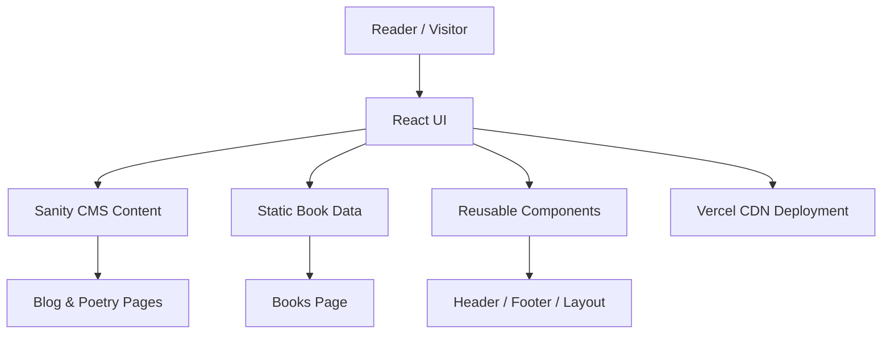

# **Author Portfolio — Deepak Joshi**

A modern **author & poet portfolio website** built using **React**, **Vite**, and **Tailwind CSS**.
This website showcases my **blogs, poetry, books, and personal writing journey** with a clean, minimal aesthetic inspired by literature-focused design — optimized for readability, performance, and scalability.

---

## **Live Demo**

**Website:**
👉 [https://authors-page-iota.vercel.app/](https://authors-page-iota.vercel.app/)


---

# **Table of Contents**

1. [Overview](#overview)
2. [Features](#features)
3. [Folder Structure](#folder-structure)
4. [How to Run Locally](#how-to-run-locally)
5. [Architecture & Design Decisions](#architecture--design-decisions)

   * Component Architecture
   * Content Architecture
   * Mermaid Diagram
6. [UI/UX Approach](#uiux-approach)
7. [Content & Rendering Flow](#content--rendering-flow)
8. [Challenges & Trade-Offs](#challenges--trade-offs)
9. [Performance & Deployment Notes](#performance--deployment-notes)

---

# **Overview**

This repository contains my **personal author portfolio**, built to present:

* My blogs & travel writing
* My poetry collections
* My published & upcoming books
* My creative identity as a writer
* My social & publishing presence

The website follows a **content-first architecture**, where:

* Blogs & poems are managed via **Sanity CMS**
* Books are managed via a simple **data configuration file**
* Layout and typography emphasize **reading comfort**

The UI is fully responsive and designed for:

* Readers
* Editors & publishers
* Literary platforms
* General audiences

---

### **Tech Stack**

* **React** — UI framework
* **Vite** — fast build tooling
* **Tailwind CSS** — utility-first styling
* **Sanity CMS** — blog & poetry content management
* **Vercel** — deployment & hosting

---

# **Features**

### Literary-Focused Design

Minimal, calm, and distraction-free layout inspired by author websites and print aesthetics.

---

### Blogs & Poetry (Sanity CMS)

* Rich text support
* Headings, paragraphs, and formatting
* Separate blog & poetry sections
* Individual detail pages

---

### Books Section

Each book includes:

* Cover image
* Title
* Description
* External purchase/read links

---

### Fully Responsive Layout

Optimized for:

* Mobile reading
* Tablet browsing
* Desktop viewing

---

### SEO Friendly

* Clean URLs
* Semantic HTML
* Optimized metadata
* Fast load times

---

### High Performance

* Vite-powered builds
* Tailwind’s minimal CSS output
* CDN delivery via Vercel

---

# **Folder Structure**

```
authors-page/
│
├── src/
│   ├── components/         # Header, Footer, reusable UI components
│   ├── pages/              # Home, Blogs, BlogDetail, Poetry, PoemDetail, Books, Contact
│   ├── data/               # Books data configuration
│   ├── assets/             # Images, book covers, hero images
│   ├── sanityClient.js     # Sanity CMS client setup
│   ├── App.jsx             # App routes
│   ├── main.jsx            # Entry point
│
├── public/                 # Favicon, static files
├── index.html
├── tailwind.config.js
├── package.json
├── README.md
```

---

# **How to Run Locally**

## **1. Clone Repository**

```bash
git clone https://github.com/Deepak-J0shi/My-Authors-Page.git
cd My-Authors-Page
```

---

## **2. Install Dependencies**

```bash
npm install
```

---

## **3. Start Development Server**

```bash
npm run dev
```

App will run at:

```
http://localhost:5173
```

---

## **4. Build for Production**

```bash
npm run build
```

---

## **5. Preview Production Build**

```bash
npm run preview
```

---

# **Architecture & Design Decisions**

## **Why React?**

* Component-based layout
* Easy content-driven UI
* Scales well as content grows

---

## **Why Tailwind CSS?**

* Typography consistency
* Fast design iteration
* Clean, minimal aesthetic
* No bloated CSS files

---

## **Why Sanity CMS?**

* Rich text editing
* Structured content
* Easy to add blogs & poems
* Separation of content & UI

---

## **Why Vercel?**

* Seamless React deployment
* SPA routing support
* Global CDN
* Zero configuration

---

## **Mermaid Diagram**



---

# **UI/UX Approach**

### Reading-First Design

* Large readable fonts
* Generous spacing
* Calm color palette
* Minimal visual noise

---

### Clear Navigation

Home → Blogs → Poetry → Books → Contact

---

### Component Reusability

* Shared layout styles
* Consistent card design
* Unified typography system

---

### Subtle Interactions

* Hover transitions
* Micro-animations
* No heavy motion — content remains primary

---

# **Content & Rendering Flow**

### User visits website

→ React loads layout

### CMS content fetched (blogs & poems)

→ Rendered via PortableText

### Static content (books, images) loaded

→ Displayed via config

### Tailwind handles responsive styling

### Vercel serves optimized build

---

# **Challenges & Trade-Offs**

### Challenge — SPA Refresh Errors on Vercel

✔ Solved using proper SPA routing configuration.

---

### Challenge — Maintaining reading comfort across devices

✔ Solved with responsive typography & spacing.

---

### Trade-Off — CMS dependency

**Pros:** Easy updates, clean separation
**Cons:** Requires Sanity availability

---

# **Performance & Deployment Notes**

* Built with **Vite** → ultra-fast dev & build
* Deployed on **Vercel** → instant global delivery
* Tailwind ensures minimal CSS bundle
* CMS data fetched efficiently
* Optimized for long-form reading
